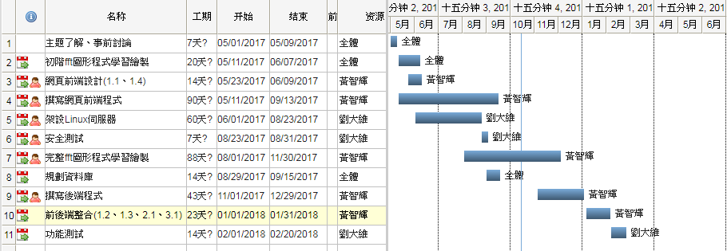

# -pulser_introduction
### 主題: 脈聲 Pulser   3B 第一組
### 指導老師: 鄭進興 老師
### 組員: 0424002 黃智輝   0424090 劉大維
### 架構: 軟體 :網頁前端、後端、視覺化  硬體 :Linux server 設置與維護
### 功能簡介: 使用者可以透過機器取得脈膊資料，透過程式轉換成圖形讓使用者及醫生清楚了解身體狀況 使用者可以看歷史資料做比較
### 基本會員註冊、登入、修改、檢測紀錄、查詢
### 部分網頁介面

## 功能性需求
### 1.儀表板
####  1.1 使用者可以瀏覽測量結果(包含日期、時間、心跳、fft圖形等)
####  1.2 使用者可以瀏覽及修改其基本資料
####  1.3 使用者可以查詢不同日期的測量結果
####  1.4 使用者可以瀏覽醫師建議及提醒
### 2.紀錄
####  2.1 使用者可以查詢完整的測量數據，並且可以匯出到excel
### 3.查詢
####  3.1 使用者可以設定條件來看測量結果
## 非功能性需求
### 1.操作性
####  1.1 系統可以在行動裝置及瀏覽器上使用
### 2.效能
####  2.1 使用者一更新或上傳測量資料，系統會即時更新
####  2.2 系統應全年無休
### 3.安全
####  3.1 只有該帳號的使用者及醫師能夠瀏覽及修改測量結果
### 甘特圖

