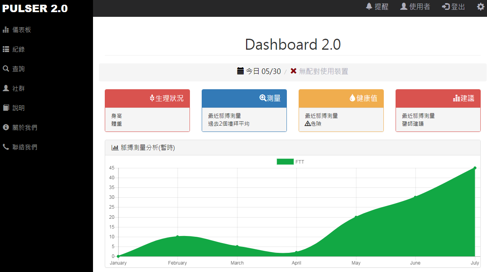

# -pulser_introduction
### 主題: 脈聲 Pulser   3B 第一組
### 指導老師: 鄭進興 老師
### 組員: 0424002 黃智輝   0424090 劉大維
### 架構: 軟體 :網頁前端、後端、視覺化  硬體 :Linux server 設置與維護
### 功能簡介: 使用者可以透過機器取得脈膊資料，透過程式轉換成圖形讓使用者及醫生清楚了解身體狀況 使用者可以看歷史資料做比較
### 基本會員註冊、登入、修改、檢測紀錄、查詢
### 部分網頁介面

